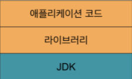
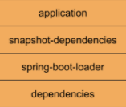

## 스프링 부트 애플리케이션 도커 이미지 만들기
- 스프링 부트 애플리케이션을 도커 이미지로 만드는 방법
- Dockerfile

```dockerfile
FROM openjdk:11.0.8-jre-slim
WORKDIR application
ARG JAR_FILE=target/demo*.jar
COPY ${JAR_FILE} application.jar
ENTRYPOINT ["java","-jar","application.jar"]
```

- 이미지 빌드하기

```bash
docker build -t demo-springboot23 .
```

- 도커 컨네이터 실행하기

```bash
docker run --rm -p 8080:8080 demo-springboot23 
```

- 도커 이미지 탐색기 “dive”
    * https://github.com/wagoodman/dive
- 참고
    * https://docs.spring.io/spring-boot/docs/2.3.0.RELEASE/maven-plugin/reference/html/#introduction

## 보다 효율적인 도커 이미지 만들기
- 스프링 부트 JAR 파일 구성 요소
  * BOOT-INF/lib: 라이브러리
  * BOOT-INF/classes: 애플리케이션 코드 및 리소스
  * META-INF: MANIFEST와 maven 프로퍼티 및 pom.xml
- 가장 변하지 않는 것부터 이미지 레이어 쌓기

  

  * 변하지 않은 레이어는 캐시를 사용하기 때문에 빌드가 더 효율적이다.
- 효율적인 Dockerfile 설정

```dockerfile
FROM openjdk:11.0.8-jdk-slim AS builder
WORKDIR source
ARG JAR_FILE=target/demo*.jar
COPY ${JAR_FILE} application.jar
RUN jar -xf ./application.jar

FROM openjdk:11.0.8-jre-slim
WORKDIR application
COPY --from=builder source/BOOT-INF/lib lib
COPY --from=builder source/BOOT-INF/classes app
ENTRYPOINT ["java","-cp","app:lib/*","me.sungbin.demospringboot23prop.App"]
```

## 스프링 부트로 효율적인 도커 이미지 만들기
- 스프링 부트 2.3+에서 계층형 빌드 설정

```xml
<plugin>
    <groupId>org.springframework.boot</groupId>
    <artifactId>spring-boot-maven-plugin</artifactId>
    <configuration>
        <layers>
            <enabled>true</enabled>
        </layers>
    </configuration>
</plugin>
```

- 계층형 빌드 JAR 실행하기

```bash
java -Djarmode=layertools -jar demo.jar 
```

- 스프링 부트 기본 계층


  
  * Application: 애플리케이션 코드 및 리소스
  * Snapshot 라이브러리: 버전이 SNAPSHOT인 라이브러리
  * 스프링 부트 로더: 스프링 부트 JAR 실행기 들어있는 패키지
  * Dependencies: 버전이 SNAPSHOT이 아닌 라이브러리
- 참고
  * https://docs.spring.io/spring-boot/docs/2.3.0.RELEASE/maven-plugin/reference/html/#repackage-layers