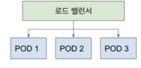
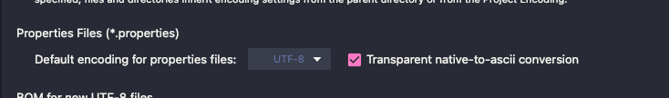

## Liveness와 Readiness
- Liveness
    * 애플리케이션이 살아있는가?
    * 상태가 비정상이고 복구하지 못한다면 보통 애플리케이션을 재기동 한다.
    * LivenessState.CORRECT
    * LivenessState.BROKEN
- Readiness
    * 요청을 받을 준비가 되었는가?
    * 준비가 될때까지 해당 서버로 요청을 보내지 않고 다른 서버로 보낸다.
    * ReadinessState.ACCEPTING_TRAFFIC
    * ReadinessState.REFUSING_TRAFFIC
- 애플리케이션 내부에서 상태 정보 조회하기
    * 스프링 부트 2.3부터 자동으로 빈으로 등록해주는 ApplicationAvailability를 통해서 확인할 수 있다.

```java
class Main {
    @Autowired ApplicationAvailability availability;

    LivenessState livenessState = availabilityProvider.getLivenessState();
    ReadinessState readinessState = availabilityProvider.getReadinessState();
}
```

- 애플리케이션 밖에서 상태 정보 조회하기, Actuator /health 엔드포이트 사용
    * 해당 Health 그룹은 쿠버네티스에 배포할 때는 true로 제공한다.
    * Liveness: actuator/health/liveness
    * Readiness: actuator/health/readiness

```properties
management.endpoint.health.probes.enabled=true
```

- 애플리케이션 상태 변경하기
    * 스프링 ApplicationEventPublisher를 사용해서 이벤트를 전파하는 방법으로 상태 변경한다.

```java
AvailabilityChangeEvent.publish(this.applicationEventPublisher, this, ReadinessState.REFUSING_TRAFFIC);
```

- 애플리케이션 상태 변경 감지하기

```java
@Async
@EventListener
public void onStateChanged(AvailabilityChangeEvent<ReadinessState> readiness) {
// 이벤트 처리
}
```

- 참고
    * https://spring.io/blog/2020/03/25/liveness-and-readiness-probes-with-spring-boot

## Liveness와 Readiness 쿠버네티스 연동
- 스프링 부트 애플리케이션 이벤트에 따라 Liveness와 Readiness가 달라진다.
- 쿠버네티스의 Liveness probe
  * 특정 횟수 (기본값 3회) 이상 Liveness 상태가 안좋은 경우 해당 애플리케이션을 재시작한다.
- 쿠버네티스의 Readiness probe
  * Readiness 상태가 안좋은 경우 해당 pod로 요청을 보내지 않는다.

  

- 참고
  * https://kubernetes.io/docs/tasks/configure-pod-container/configure-liveness-readiness-startup-probes/
  * https://docs.spring.io/spring-boot/docs/current/reference/html/spring-boot-features.html#boot-features-application-availability-readiness-state
  * https://docs.spring.io/spring-boot/docs/current/reference/html/production-ready-features.html#production-ready-kubernetes-probes

## Actuator, configprops 엔드포인트
- 퀴즈! service.message로 입력받은 문자열을 ServiceProperties 클래스의 message라는 변수로 바인딩 받아 보세요. (스프링 부트 2.2에서 배웠습니다.)
  * @ConfigurationProperties를 사용할 것.
  * 스캐닝을 사용해서 빈으로 등록할 것.
  * 생성자 주입을 사용해서 immutable하게 만들 것.
- 스프링 부트 2.3의 actuactor/configprops 엔드포인트 변경 내역
  * 프로퍼티 값을 어디서 읽어왔는지 알려준다.

  ```json
  "inputs": {
    "message": {
      "origin": "class path resource [application.properties]:4:17",
    "value": "classpath message"
    }
  }
  ```

- Actuator 엔드포인트 공개
  
  ```properties
  // 선별적인 공개
  management.endpoints.web.exposure.include=info,health,configprops
  
  // 모두 공개 이후 선별적인 비공개
  management.endpoints.web.exposure.include=*
  management.endpoints.web.exposure.exclude=shutdown
  ```

- 참고
  * https://docs.spring.io/spring-boot/docs/current/actuator-api/html/#overview

## Properties 파일에 한글을 쓰면 왜 깨지는걸까?
- 자바는 properties 파일을 ISO 8859-1 인코딩을 사용해서 읽어들이고 해당 인코딩으로 표현할 수 없는 문자는 Unicode로 작성해야 합니다.
- https://docs.oracle.com/javase/8/docs/api/java/util/Properties.html

>The load(Reader) / store(Writer, String) methods load and store properties from and to a character based stream in a simple line-oriented format specified below. The load(InputStream) / store(OutputStream, String) methods work the same way as the load(Reader)/store(Writer, String) pair, except the input/output stream is encoded in ISO 8859-1 character encoding. Characters that cannot be directly represented in this encoding can be written using Unicode escapes as defined in section 3.3 of The Java™ Language Specification; only a single 'u' character is allowed in an escape sequence. The native2ascii tool can be used to convert property files to and from other character encodings.

- 즉, properties 파일에 한글을 쓰고 싶다면 유니코드로 변경해서 입력을 해야 합니다.
- 그러나! 우리가 일일히 변환을 하면 불편하기 때문에 IDE가 알아서 해줍니다. (체크 하세요.)

